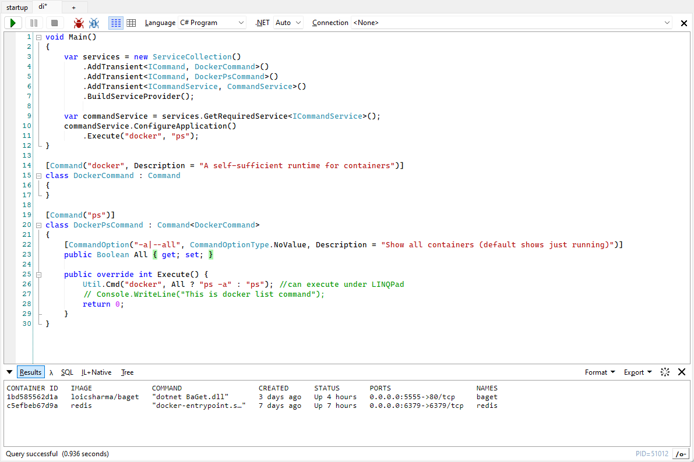

[TOC]

## 快速开始

我们将通过以下步骤展示如何从头开始编写自己的 cli 应用和命令

### 1. 新建项目

创建一个 netcoreapp3.1 或 net5.0 类库项目，并引用依赖 *PomeloCli*

```bash
$ dotnet new console --framework netcoreapp3.1
$ dotnet add package PomeloCli --version 1.2.2
```

如果使用 IDE，引用依赖 *PomeloCli* 后项目文件(csproj)包含以下内容

```xml
  <ItemGroup>
    <PackageReference Include="PomeloCli" Version="1.2.2" />
  </ItemGroup>
```

### 2. 添加内容

修改 *Program.cs*，替换成以下内容

```c#
using System;
using PomeloCli;
using PomeloCli.Attributes;

namespace test
{
    class Program
    {
        static void Main(string[] args)
        {
            var commands = new[]{
                new EchoCommand()
            };
            new CommandService(commands)
                .ConfigureApplication()
                .Execute(args.Length > 0 ? args: new[] { "echo", "Hello PomeloCli" });
        }
    }

    [Command("echo")]
    class EchoCommand : Command
    {
        [CommandArgument("input", false)]
        public String Input { get; set; }

        public override int Execute()
        {
            Console.WriteLine(Input);
            return 0;
        }
    }
}
```

你可以看到当前实现包含了一个命令 `EchoCommand`

- 特性 `[Command("echo")]` 提供了入口说明
- 属性 `Input` 及相应特性 `[CommandArgument("input", false)]` 表示可以接受参数
- 方法 `public override int Execute()` 展示了命令的内部逻辑，它会原样打印输入的字符串

完整示例可以参考 [samples/1-get-start](samples/1-get-start)

### 3. 首次运行项目

我们查看一下自带的使用帮助

```bash
$ dotnet run -- -h


Usage:  [options] [command]

Options:
  -?|-h|--help  Show help information

Commands:
  echo

Use " [command] --help" for more information about a command.
```

运行 `echo` 命令

```bash
$ dotnet run
hello PomeloCli

$ dotnet run --no-build -- echo "the first cli demo"
the first cli demo
```

### 4. 使用依赖注入

继续引用 *Microsoft.Extensions.DependencyInjection* 

```bash
$ dotnet add package Microsoft.Extensions.DependencyInjection --version 5.0.2
```

如果使用 IDE，引用依赖 *PomeloCli* 后项目文件(csproj)包含以下内容

```xml
  <ItemGroup>
    <PackageReference Include="Microsoft.Extensions.DependencyInjection" Version="5.0.2" />
    <PackageReference Include="PomeloCli" Version="1.2.2" />
  </ItemGroup>
```

### 5. 使用子命令

接着修改 *Program.cs*，添加 docker 相关的命令，并使用依赖注入管理它们

```c#
using System;
using PomeloCli;
using PomeloCli.Attributes;
using Microsoft.Extensions.CommandLineUtils;
using Microsoft.Extensions.DependencyInjection;

namespace test
{
    class Program
    {
        static void Main(string[] args)
        {
            var services = new ServiceCollection()
                .AddTransient<ICommand, DockerCommand>()
                .AddTransient<ICommand, DockerPsCommand>()
                .AddTransient<ICommandService, CommandService>()
                .BuildServiceProvider();

            var commandService = services.GetRequiredService<ICommandService>();
            commandService.ConfigureApplication()
                .Execute(args);
        }
    }

    [Command("docker", Description = "A self-sufficient runtime for containers")]
    class DockerCommand : Command
    {
    }

    [Command("ps")]
    class DockerPsCommand : Command<DockerCommand>
    {
        [CommandOption("-a|--all", CommandOptionType.NoValue, Description = "Show all containers (default shows just running)")]
        public Boolean All { get; set; }

        public override int Execute()
        {
            // Util.Cmd("docker", All ? "ps -a" : "ps"); //can execute under LINQPad
            Console.WriteLine("This is docker list command");
            return 0;
        }
    }
}
```

你可以注意到命令 `DockerPsCommand` 的定义方式与之前的 `EchoCommand` 及当前的 `DockerCommand` 不一样

- `DockerPsCommand` 继承自泛型 `Command<T>`，是命令 `DockerCommand` 的子命令；
- 命令特性 `[Command]` 及参数特性 `[CommandOption]` 都有可选的属性 `Description` 以描述用法
- 父命令一般是空命令

完整示例可以参考 [samples/1-get-start](samples/2-dependency-inject)

### 6. 重新运行项目

查看命令 `docker ps` 的使用帮助

```bash
$ dotnet run -- docker ps -h


Usage:  docker ps [options]

Options:
  -?|-h|--help  Show help information
  -a|--all      Show all containers (default shows just running)
```

运行命令 `docker ps -a`

```bash
$ dotnet run --no-build -- docker ps -a
This is docker list command
```

如果在 LINQPad 下使用，可以将 `Console.WriteLine()` 语句替换为调用 `Util.Cmd()` 以查看效果。



### 7. 打包应用

为了可以将应用交付给用户，我们需要修改项目文件以支持打包为 dotnet 工具

```diff
   <PropertyGroup>
     <OutputType>Exe</OutputType>
     <TargetFramework>netcoreapp3.1</TargetFramework>
+    <PackAsTool>true</PackAsTool>
+    <ToolCommandName>mycli</ToolCommandName>
+    <PackageId>MyCli</PackageId>
   </PropertyGroup>
```

然后使用 `dotnet pack` 命令即可以将控制台打包成 dotnet 工具

```bash
$ dotnet pack -o nupkgs
Microsoft (R) Build Engine version 17.1.0+ae57d105c for .NET
Copyright (C) Microsoft Corporation. All rights reserved.

  Determining projects to restore...
  Restored D:\Documents\mywork\PomeloCli\docs\3-pack-as-tool\MyCli.csproj (in 379 ms).
  MyCli -> D:\Documents\mywork\PomeloCli\docs\3-pack-as-tool\bin\Debug\netcoreapp3.1\MyCli.dll
  MyCli -> D:\Documents\mywork\PomeloCli\docs\3-pack-as-tool\bin\Debug\netcoreapp3.1\MyCli.dll
  Successfully created package 'D:\Documents\mywork\PomeloCli\docs\3-pack-as-tool\nupkgs\MyCli.1.0.0.nupkg'.
```

在将包推送到 nuget 或我们自己的服务器前，可以使用 `dotnet tool` 命令安装本地文件

```bash
$ dotnet tool install mycli -g --add-source nupkgs --configfile disable_nuget.config
You can invoke the tool using the following command: mycli
Tool 'mycli' (version '1.0.0') was successfully installed.
```

> 文件 [samples/3-pack-as-tool/disable_nuget.config](samples/3-pack-as-tool/disable_nuget.config) 的作用是避免包标识冲突，可以阅读 [How to fix NU1212 for dotnet tool install](https://stackoverflow.com/questions/52527004/how-to-fix-nu1212-for-dotnet-tool-install) 以获取进一步的信息。

最后就可以使用命令 `mycli` 作为我们的 cli 工具入口了

```bash
$ mycli docker ps -a
This is docker list command
```

完整示例可以参考 [samples/3-pack-as-tool](samples/3-pack-as-tool)

### 8. 小结

至此你已经了解到以下内容

- 如何编写基本的命令并声明入口 `[Command]`
- 如何为命令添加参数 `[CommandArgument]` 和选项 `[CommandOption]`
- 如何编写子命令
- 如何为命令及参数编写说明
- 如何编写基本的控制台程序管理自己的命令
- 如何查看命令的使用帮助
- 如何使用依赖注入管理自己的命令
- 如何打包为 dotnet tool
- 如何安装自己的打包应用

有了以上能力，我们可以借助 *dotnet tool* 的能力将自己的应用打包成 cli 应用，而如何插件化以应对业务命令增长的需求，将在后面进一步介绍。

## 进阶话题

命令行并不是新鲜话题，但是长久以来缺乏标准。在跨平台开发及云原生推广的背景下，*inux 下诸多工具的使用方式提供了有效参考，像 docker、kubectl 甚至 dotnet 的 CLI 工具使用都有以下形式：

```bash
[command] [options] [arguments]
[command] [options] [sub-command] [sub-command-options] [sub-command-arguments]
```

它们引入了以下概念：

- command：命令
- options：选项
- arguments: 参数

`sub-command` 是子命令，其结构与首行相同，仍然由选项(Options) 和参数(Arguments) 组成。

> 注意：子命令可以继续包含下级命令。

### 命令(Command)

命令(command) 是工具调用入口，复杂工具像 kubectl 等可能会包含若干层层子命令，下文将描述。

### 参数(Arguments)

参数(arguments)用来表示被操作的对象，它可能是单个也可以是多个，取决于具体实现

- 以 shell 解压缩命令 `unzip something.zip -d somewhere` 示例，`something.zip` 表示解压的文件，是单个参数
- 以 shell 删除命令 `rm 1.log 2.log` 示例，`1.log 2.log` 表示要删除的文件名，是多个参数

### 选项(Options)

选项(Options) 用来对命令(Command) 进行补充，它常常有简写和全名模式，像 `dotnet -h ` 与 `dotnet --help` 是等效的，都会打印帮助信息。

#### 无值

- 以 shell 删除命令 `rm -rf src/` 示例，`-r, -R, --recursive` 是递归选项，`-f, --force` 是强制删除选项，无须补充参数值，该命令表示强制递归删除目录。

#### 单值

- 以 shell 解压缩命令 `unzip something.zip -d somewhere` 示例，`-d somewhere` 表示将压缩文件解压到 *somewhere* 目录
- 以 shell 的文件读取命令 `head somefile -n 1` 示例，`-n 1` 表示读取一行，`--number 1` 效果相同

#### 多值

- 以容器部署命令 `docker-compose up -f docker-compose.yml -f docker-compose.override.yml` 示例，该命令包含了两个 yaml 文件，它们会被合并读取。

### 关于子命令

当工具包含的功能非常多的时候，将部分命令拆分出来以子命令提供更加友好，避免了各种选项和参数的组合使用带来的使用困惑和记忆负担。截取 kubectl 的部分使用说明如下

```bash
$ kubectl -h
kubectl controls the Kubernetes cluster manager.

 Find more information at: https://kubernetes.io/docs/reference/kubectl/overview/

Basic Commands (Beginner):
  create        Create a resource from a file or from stdin
  expose        Take a replication controller, service, deployment or pod and expose it as a new Kubernetes service
  run           Run a particular image on the cluster
  set           Set specific features on objects

Basic Commands (Intermediate):
  explain       Get documentation for a resource
  get           Display one or many resources
  edit          Edit a resource on the server
  delete        Delete resources by file names, stdin, resources and names, or by resources and label selector

Deploy Commands:
  rollout       Manage the rollout of a resource
  scale         Set a new size for a deployment, replica set, or replication controller
  autoscale     Auto-scale a deployment, replica set, stateful set, or replication controller

Cluster Management Commands:
  certificate   Modify certificate resources.
  cluster-info  Display cluster information
  top           Display resource (CPU/memory) usage
  cordon        Mark node as unschedulable
  uncordon      Mark node as schedulable
  drain         Drain node in preparation for maintenance
  taint         Update the taints on one or more nodes
  
...
```

可以看到 k8s 的命令很多，但根据业务拆分的很细，方便了运维人员记忆，降低了使用成本。

### 命令行类库参考

实际使用中，由于各种原因并非所有工具都根据以上标准进行实现，像常见的查找命令 `find` 就很复杂，能够支持各种条件组合。个人觉得以上标准通俗易于理解和实现，且能够满足日常使用，据此本项目借助 Microsoft.Extensions.CommandLineUtils 提供了对以上标准的支持。

其他语言像 python 和 java 都有自己的解决方案，列举如下请自行参数。

- [argparse — Parser for command-line options, arguments and sub-commands](https://docs.python.org/3/library/argparse.html)
- [picocli - a mighty tiny command line interface](https://picocli.info/)

## 高级话题[TODO]

### 命令插件化

### 更新检查

### 使用情况上报

## 路线图

### 自助打包

## 参考文档

- [Creating a console app with Dependency Injection in .NET Core](https://siderite.dev/blog/creating-console-app-with-dependency-injection-in-/)
- [Tutorial: Create a .NET tool using the .NET CLI](https://docs.microsoft.com/en-us/dotnet/core/tools/global-tools-how-to-create)

