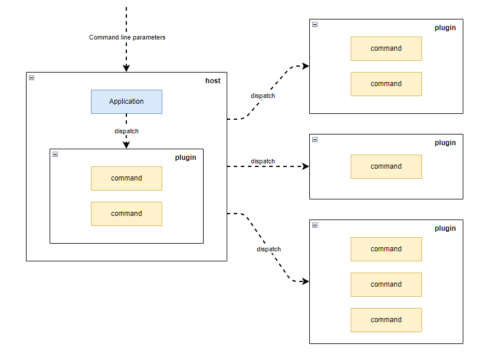

# PomeloCli 是什么

我们已经有相当多的命令行工具实现或解析类库，PomeloCli 并不是替代版本，它基于 [Nate McMaster](https://github.com/natemcmaster) 的杰出工作 [CommandLineUtils](https://github.com/natemcmaster/CommandLineUtils)、[DotNetCorePlugins](https://github.com/natemcmaster/DotNetCorePlugins) 实现了一整套的命令行开发、管理、维护方案，在此特别鸣谢 Nate。

# 为什么实现

作者述职于 devOps 部门，编写、维护 CLI 工具并将其部署到各个服务器节点上是很常规的需求，但是又常常面临一系列问题。

## 太多的工具太少的规范

命令行工具开发自由度过高，随之而来的是迥异的开发和使用体验：

- 依赖和配置管理混乱；
- 没有一致的参数、选项标准，缺失帮助命令；
- 永远找不到版本对号的说明文档；

## 基于二进制拷贝分发难以为继

工具开发完了还需要部署到计算节点上，但是对运维人员极其不友好：

- 永远不知道哪些机器有没有安装，安装了什么版本；
- 需要进入工具目录配置运行参数；

# 快速开始

你可以直接开始，但是在此之前理解命令、参数和选项仍然有很大的帮助。相关内容可以参考 [Introduction](https://natemcmaster.github.io/CommandLineUtils/docs/intro.html).

## 引用 PomeloCli 开发命令行应用

引用 PomeloCli 来快速创建自己的命令行应用

```bash
$ dotnet new console -n SampleApp
$ cd SampleApp
$ dotnet add package PomeloCli -v 1.3.0
```

在入口程序添加必要的处理逻辑，文件内容见于 [docs/sample/3-sample-app/Program.cs](docs/sample/3-sample-app/Program.cs)。这里使用了依赖注入管理命令，相关参考见 [.NET 依赖项注入](https://learn.microsoft.com/zh-cn/dotnet/core/extensions/dependency-injection)。

```c#
using System;
using System.Threading.Tasks;
using Microsoft.Extensions.DependencyInjection;
using PomeloCli;

class Program
{
    static async Task<int> Main(string[] args)
    {
        var services = new ServiceCollection()
            .AddTransient<ICommand, EchoCommand>()
            .AddTransient<ICommand, HeadCommand>()
            .BuildServiceProvider();

        var application = ApplicationFactory.ConstructFrom(services);
        return await application.ExecuteAsync(args);
    }
}
```

这里有两个命令：EchoCommand，是对 echo 命令的模拟，文件内容见于 [docs/sample/3-sample-app/EchoCommand.cs](docs/sample/3-sample-app/EchoCommand.cs)

```c#
#nullable disable
using System;
using System.Threading;
using System.Threading.Tasks;
using McMaster.Extensions.CommandLineUtils;
using PomeloCli;

[Command("echo", Description = "display a line of text")]
class EchoCommand : Command
{
    [Argument(0, "input")]
    public String Input { get; set; }

    [Option("-n|--newline", CommandOptionType.NoValue, Description = "do not output the trailing newline")]
    public Boolean? Newline { get; set; }

    protected override Task<int> OnExecuteAsync(CancellationToken cancellationToken)
    {
        if (Newline.HasValue)
        {
            Console.WriteLine(Input);
        }
        else
        {
            Console.Write(Input);
        }
        return Task.FromResult(0);
    }
}

```

HeadCommand是对 head 命令的模拟，文件内容见于 [docs/sample/3-sample-app/HeadCommand.cs](docs/sample/3-sample-app/HeadCommand.cs)。

```c#
#nullable disable
using System;
using System.ComponentModel.DataAnnotations;
using System.IO;
using System.Linq;
using System.Threading;
using System.Threading.Tasks;
using McMaster.Extensions.CommandLineUtils;
using PomeloCli;

[Command("head", Description = "Print the first 10 lines of each FILE to standard output")]
class HeadCommand : Command
{
    [Required]
    [Argument(0)]
    public String Path { get; set; }

    [Option("-n|--line", CommandOptionType.SingleValue, Description = "print the first NUM lines instead of the first 10")]
    public Int32 Line { get; set; } = 10;

    protected override Task<int> OnExecuteAsync(CancellationToken cancellationToken)
    {
        if (!File.Exists(Path))
        {
            throw new FileNotFoundException($"file '{Path}' not found");
        }

        var lines = File.ReadLines(Path).Take(Line);
        foreach (var line in lines)
        {
            Console.WriteLine(line);
        }
        return Task.FromResult(0);
    }
}
```

进入目录 SampleApp 后，既可以通过 `dotnet run -- --help` 查看包含的 `echo` 和 `head` 命令及使用说明。

```bash
$ dotnet run -- --help
Usage: SampleApp [command] [options]

Options:
  -?|-h|--help  Show help information.

Commands:
  echo          display a line of text
  head          Print the first 10 lines of each FILE to standard output

Run 'SampleApp [command] -?|-h|--help' for more information about a command.

$ dotnet run -- echo --help
display a line of text

Usage: SampleApp echo [options] <input>

Arguments:
  input

Options:
  -n|--newline  do not output the trailing newline
  -?|-h|--help  Show help information.
```

也可以编译使用可执行的 SampleApp.exe 。

```bash
$ ./bin/Debug/net8.0/SampleApp.exe --help
Usage: SampleApp [command] [options]

Options:
  -?|-h|--help  Show help information.

Commands:
  echo          display a line of text
  head          Print the first 10 lines of each FILE to standard output

Run 'SampleApp [command] -?|-h|--help' for more information about a command.

$ ./bin/Debug/net8.0/SampleApp.exe echo --help
display a line of text

Usage: SampleApp echo [options] <input>

Arguments:
  input

Options:
  -n|--newline  do not output the trailing newline
  -?|-h|--help  Show help information.
```

BRAVO 很简单对吧。

## 引用 PomeloCli 开发命令行插件

如果只是提供命令行应用的创建能力，作者大可不必发布这样一个项目，因为 [McMaster.Extensions.CommandLineUtils](https://github.com/natemcmaster/CommandLineUtils)  本身已经做得足够好了。如上文"为什么实现章节"所说，作者还希望解决命令行工具的分发维护问题。

为了实现这一目标，PomeloCli 继续基于 [McMaster.NETCore.Plugins](https://github.com/natemcmaster/DotNetCorePlugins) 实现了一套插件系统或者说架构：

- 将命令行工具拆分成**宿主**和**插件**两部分功能；
- **宿主**负责安装、卸载、加载**插件**，作为命令行入口将参数转交给对应的**插件**；
- **插件**负责具体的业务功能的实现；
- **宿主**和**插件**均打包成标准的 nuget 制品；

插件加载示意


命令行参数传递示意



通过将宿主的维护交由 dotnet tool 处理、交插件的维护交由宿主处理，我们希望解决命令行工具的分发维护问题：

- 开发人员
  - 开发插件
  - 使用 `dotnet nuget push` 发布插件
- 运维/使用人员
  - 使用 `dotnet tool`安装、更新、卸载宿主
  - 使用 `pomelo-cli install/uninstall` 安装、更新、卸载插件

现在现在我们来开发一个插件应用。

### 开发命令行插件

引用 PomeloCli 来创建自己的命令行插件

```bash
$ dotnet new classlib -n SamplePlugin
$ cd SamplePlugin
$ dotnet add package PomeloCli -v 1.3.0
```

我们把上文提到的 EchoCommand 和 HeadCommand 复制到该项目，再添加依赖注入文件 ServiceCollectionExtensions.cs，文件内容见于 [docs/sample/4-sample-plugin/ServiceCollectionExtensions.cs](docs/sample/4-sample-plugin/ServiceCollectionExtensions.cs)

```c#
using System;
using System.Threading.Tasks;
using Microsoft.Extensions.DependencyInjection;
using PomeloCli;

public static class ServiceCollectionExtensions
{
    /// <summary>
    /// pomelo-cli load plugin by this method, see
    /// <see cref="PomeloCli.Plugins.Runtime.PluginResolver.Loading()" />
    /// </summary>
    /// <param name="services"></param>
    /// <returns></returns>
    public static IServiceCollection AddCommands(this IServiceCollection services)
    {
        return services
            .AddTransient<ICommand, EchoCommand>()
            .AddTransient<ICommand, HeadCommand>();
    }
}
```

为了能够使得插件运行起来，我们还需要在打包时将依赖添加到 nupkg 文件中。为此需要修改 csproj 添加打包配置，参考 [SamplePlugin.csproj](docs/sample/4-sample-plugin/SamplePlugin.csproj)，相关原理见出处 [How to include package reference files in your nuget](https://til.cazzulino.com/msbuild/how-to-include-package-reference-files-in-your-nuget-package)

### 搭建私有 nuget 服务

为了托管我们的工具与插件，我们这里使用 [BaGet])(https://github.com/loic-sharma/BaGet) 搭建轻量的 nuget 服务，docker-compose.yaml 已经提供见 [baget](docs/baget)，docker 等工具使用请自行查阅。

```yaml
version: "3.3"
services:
  baget:
    image: loicsharma/baget
    container_name: baget
    ports:
      - "8000:80"
    volumes:
      - $PWD/data:/var/baget
```

我们使用 `docker-compose up -d` 将其运行起来，baget 将在地址 http://localhost:8000/ 上提供服务。

### 发布命令行插件

现我们在有了插件和 nuget 服务，可以发布插件了。

```bash
$ cd SamplePlugin
$ dotnet pack -o nupkgs -c Debug
$ dotnet nuget push -s http://localhost:8000/v3/index.json nupkgs/SamplePlugin.1.0.0.nupkg
```

## 使用 PomeloCli  集成已发布插件

pomelo-cli 是一个 dotnet tool 应用，可以看作命令行宿主，它包含了一组 plugin 命令用来管理我们的命令行插件。

### 安装命令行宿主

我们使用标准的 dotnet tool CLI 命令安装 PomeloCli，相关参考见 [How to manage .NET tools](https://learn.microsoft.com/en-us/dotnet/core/tools/global-tools)

```bash
$ dotnet tool install PomeloCli.Host --version 1.3.0 -g --add-source http://localhost:8000/v3/index.json
$ pomelo-cli --help
Usage: PomeloCli.Host [command] [options]

Options:
  -?|-h|--help  Show help information.

Commands:
  config
  plugin
  version

Run 'PomeloCli.Host [command] -?|-h|--help' for more information about a command.
```

可以看到 pomelo-cli 内置了部分命令。

### 集成命令行插件

pomelo-cli 内置了一组插件，包含了其他插件的管理命令

```bash
$ pomelo-cli plugin install SamplePlugin -v 1.0.0 -s http://localhost:8000/v3/index.json
$ pomelo-cli --help
Usage: PomeloCli.Host [command] [options]

Options:
  -?|-h|--help  Show help information.

Commands:
  config
  echo          display a line of text
  head          Print the first 10 lines of each FILE to standard output
  plugin
  version

Run 'PomeloCli.Host [command] -?|-h|--help' for more information about a command.

$ pomelo-cli echo --help
display a line of text

Usage: PomeloCli.Host echo [options] <input>

Arguments:
  input

Options:
  -n|--newline  do not output the trailing newline
  -?|-h|--help  Show help information.

```

可以看到 SamplePlugin 包含的 echo 和 head 命令已经被显示在子命令列表中。

### 卸载命令行插件

pomelo-cli 当然也可以卸载其他插件

```bash
$ pomelo-cli plugin uninstall SamplePlugin
```

### 卸载命令行宿主

我们使用标准的 dotnet tool CLI 命令卸载 PomeloCli

```bash
$ dotnet tool uninstall PomeloCli.Host -g
```

## 引用 PomeloCli 开发命令行宿主

TODO:

### 其他：异常 NU1102 的处理

当安装插件失败且错误码是**NU1102** 时，表示未找到对应版本，可以执行命令 `$ dotnet nuget locals http-cache --clear` 以清理 HTTP 缓存。

```bash
info : Restoring packages for C:\Users\leon\.PomeloCli.Host\Plugin.csproj...
info :   GET http://localhost:8000/v3/package/sampleplugin/index.json
info :   OK http://localhost:8000/v3/package/sampleplugin/index.json 2ms
error: NU1102: Unable to find package SamplePlugin with version (>= 1.1.0)
error:   - Found 7 version(s) in http://localhost:8000/v3/index.json [ Nearest version: 1.0.0 ]
error: Package 'SamplePlugin' is incompatible with 'user specified' frameworks in project 'C:\Users\leon\.PomeloCli.Host\Plugin.csproj'.
```

# 其他事项

## 已知问题

- refit 支持存在问题

## 路线图

- 业务插件配置

项目仍然在开发中，欢迎与我交流想法
