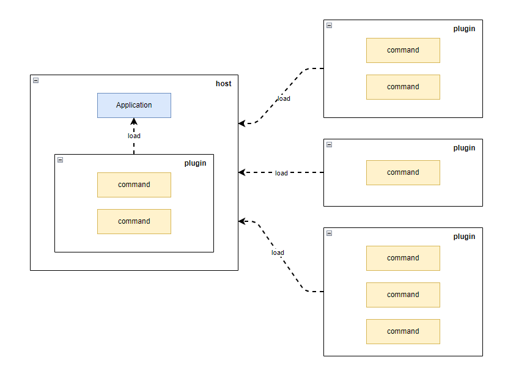

[TOC]

# What Is PomeloCli

- [中文版](./README.md)
- [English version](./README_en.md)

We already have a considerable number of command-line implementation or resolution class libraries, and PomeloCli is not an alternative version, it is based on the outstanding work of [Nate McMaster] (https://github.com/natemcmaster), including [CommandLineUtils] (https://github.com/natemcmaster/CommandLineUtils), and [DotNetCorePlugins] (https://github.com/natemcmaster/DotNetCorePlugins). PomeloCli implemented a solution for command line tool development, management, and maintenance. Especially thanks to Nate.

# Why It

In the devOps department, it is a common requirement to develop, maintain and deploy CLI tools to various server nodes, but often encounters a series of problems.

## Too many tools too few norms

Excessive freedom of command-line development, followed by a distinctive development and usage experience:

- Configuration and dependence management confusion; 
- No consistent parameters, optional criteria, missing help commands; 
- Never found documentation version paired;

## Difficult to distribute based on binary copies

The tool has been developed and needs to be deployed to the computing node, but is extremely unfriendly for operators:

- Never know which machines have been deployed, ant with which version;
- Need to enter the tool directory configurate runtime parameters.

# Quick start

You can start right away, but understanding command, parameter and option before is still very helpful, which could found on [Introduction](https://natemcmaster.github.io/CommandLineUtils/docs/intro.html)

## 1. Reference PomeloCli Develop Command Line Application

Reference PomeloCli to quickly create your own command line application

```bash
$ dotnet new console -n SampleApp
$ cd SampleApp
$ dotnet add package PomeloCli -v 1.3.0
```

Add the necessary processing logic in the input program，see [docs/sample/3-sample-app/Program.cs](docs/sample/3-sample-app/Program.cs). We use dependence injection for command management, for reference see [.NET dependency injection] (https://learn.microsoft.com/en-us/dotnet/core/extensions/dependency-injection).

```c#
using System;
using System.Threading.Tasks;
using Microsoft.Extensions.DependencyInjection;
using PomeloCli;

class Program
{
    static async Task<int> Main(string[] args)
    {
        var services = new ServiceCollection()
            .AddTransient<ICommand, EchoCommand>()
            .AddTransient<ICommand, HeadCommand>()
            .BuildServiceProvider();

        var application = ApplicationFactory.ConstructFrom(services);
        return await application.ExecuteAsync(args);
    }
}
```

There are two commands here: EchoCommand, which is a simulation of echo commands, and the code is found in [docs/sample/3-sample-app/EchoCommand.cs](docs/sample/3-sample-app/EchoCommand.cs).

```c#
#nullable disable
using System;
using System.Threading;
using System.Threading.Tasks;
using McMaster.Extensions.CommandLineUtils;
using PomeloCli;

[Command("echo", Description = "display a line of text")]
class EchoCommand : Command
{
    [Argument(0, "input")]
    public String Input { get; set; }

    [Option("-n|--newline", CommandOptionType.NoValue, Description = "do not output the trailing newline")]
    public Boolean? Newline { get; set; }

    protected override Task<int> OnExecuteAsync(CancellationToken cancellationToken)
    {
        if (Newline.HasValue)
        {
            Console.WriteLine(Input);
        }
        else
        {
            Console.Write(Input);
        }
        return Task.FromResult(0);
    }
}
```

HeadCommand is a simulation of the head command, and the code is found in [docs/sample/3-sample-app/HeadCommand.cs](docs/sample/3-sample-app/HeadCommand.cs).

```c#
#nullable disable
using System;
using System.ComponentModel.DataAnnotations;
using System.IO;
using System.Linq;
using System.Threading;
using System.Threading.Tasks;
using McMaster.Extensions.CommandLineUtils;
using PomeloCli;

[Command("head", Description = "Print the first 10 lines of each FILE to standard output")]
class HeadCommand : Command
{
    [Required]
    [Argument(0)]
    public String Path { get; set; }

    [Option("-n|--line", CommandOptionType.SingleValue, Description = "print the first NUM lines instead of the first 10")]
    public Int32 Line { get; set; } = 10;

    protected override Task<int> OnExecuteAsync(CancellationToken cancellationToken)
    {
        if (!File.Exists(Path))
        {
            throw new FileNotFoundException($"file '{Path}' not found");
        }

        var lines = File.ReadLines(Path).Take(Line);
        foreach (var line in lines)
        {
            Console.WriteLine(line);
        }
        return Task.FromResult(0);
    }
}
```

In the SampleApp directory , you can compile then execute the SampleApp.exe then view the 'echo' and 'head' commands and instructions, via`dotnet run --help` is also OK.

```bash
$ dotnet build
$ ./bin/Debug/net8.0/SampleApp.exe --help
Usage: SampleApp [command] [options]

Options:
  -?|-h|--help  Show help information.

Commands:
  echo          display a line of text
  head          Print the first 10 lines of each FILE to standard output

Run 'SampleApp [command] -?|-h|--help' for more information about a command.

$ ./bin/Debug/net8.0/SampleApp.exe echo --help
display a line of text

Usage: SampleApp echo [options] <input>

Arguments:
  input

Options:
  -n|--newline  do not output the trailing newline
  -?|-h|--help  Show help information.
```

BRAVO, it is simple. Right?

## 2. Reference PomeloCli Develop Command Line Plugin

If just create command-line applications provided above, we don't have to publish such a project, because [CommandLineUtils](https://github.com/natemcmaster/CommandLineUtils) has done enough. As explained in the "Why It" chapter, we want to resolve issues  for command-line tools distribution and maintenance.

To achieve this goal, PomeloCli continued to implement a plugin system or architecture based on [DotNetCorePlugins](https://github.com/natemcmaster/DotNetCorePlugins)

- Split the command line tool into **Host** and **Plugin** parts; 
- **Host** responsible for installing, unloading and loading **Plugin**, passing the command to the corresponding **Plugin** as entrypoint; 
- **Plugin** is responsible for the implementation of specific business functionality; 
- **Host** and **Plugin** are packaged into standard nuget products;

Plugin Loading Flow



Command Line Parameters Dispatching Flow


We want to solve the distribution maintenance problem of command line tools by handing the maintenance of the host over to the dotnet tool and the delivery of the plugin to the host:

- Developer 
  - Development **Plugin** 
  - Publishing **Plugin** using `dotnet nuget push`
- Operating/User 
  - Installing, updating, uninstalling **Host** using `dotnet tool`
  - Installing, updating, uninstalling **Plugin** Using `pomelo-cli install/uninstall`

Now we're going to develop a plugin project.

## Develop Command Line Plugin

Reference PomeloCli to create your own command line plugin

```bash
$ dotnet new classlib -n SamplePlugin
$ cd SamplePlugin
$ dotnet add package PomeloCli -v 1.3.0
```

We copied the [EchoCommand](docs/sample/3-sample-app/EchoCommand.cs) and [HeadCommand](docs/sample/3-sample-app/HeadCommand.cs) mentioned above to the project, and added the dependency injection file ServiceCollectionExtensions.cs, see [docs/sample/4-sample-plugin/ServiceCollectionExtensions.cs](docs/sample/4-sample-plugin/ServiceCollectionExtensions.cs)

```c#
using System;
using System.Threading.Tasks;
using Microsoft.Extensions.DependencyInjection;
using PomeloCli;

public static class ServiceCollectionExtensions
{
    /// <summary>
    /// pomelo-cli load plugin by this method, see
    /// <see cref="PomeloCli.Plugins.Runtime.PluginResolver.Loading()" />
    /// </summary>
    /// <param name="services"></param>
    /// <returns></returns>
    public static IServiceCollection AddCommands(this IServiceCollection services)
    {
        return services
            .AddTransient<ICommand, EchoCommand>()
            .AddTransient<ICommand, HeadCommand>();
    }
}
```

To make plugin works, we also need to add dependencies to the nupkg file while packaging. This requires update the csproj add package parts as [docs/sample/4-sample-plugin/SamplePlugin.csproj](docs/sample/4-sample-plugin/SamplePlugin.csproj)，Which could found at [How to include package reference files in your nuget](https://til.cazzulino.com/msbuild/how-to-include-package-reference-files-in-your-nuget-package)

### Build a private nuget service

In order to host our tools and plugins, we use [BaGet](https://github.com/loic-sharma/BaGet) to build a lightweight nuget service.

```yaml
version: "3.3"
services:
  baget:
    image: loicsharma/baget
    container_name: baget
    ports:
      - "8000:80"
    volumes:
      - $PWD/data:/var/baget
```

We run it using `docker-compose up -d`, baget will be available at http://localhost:8000/

### Release command line plugin

Now we have the plugin and nuget service, and we can publish the plugin.

```bash
$ cd SamplePlugin
$ dotnet pack -o nupkgs -c Debug
$ dotnet nuget push -s http://localhost:8000/v3/index.json nupkgs/SamplePlugin.1.0.0.nupkg
```

## 3. Using PomeloCli to integrate published plugins

pomelo-cli is a dotnet tool application that can be viewed as a command line host and contains a set of plugin commands to manage our command line plugins.

### Install command line host

We use standard dotnet tool CLI command to install PomeloCli, which could find on [How to manage .NET tools](https://learn.microsoft.com/en-us/dotnet/core/tools/global-tools)

```bash
$ dotnet tool install PomeloCli.Host --version 1.3.0 -g
$ pomelo-cli --help
Usage: PomeloCli.Host [command] [options]

Options:
  -?|-h|--help  Show help information.

Commands:
  config
  plugin
  version

Run 'PomeloCli.Host [command] -?|-h|--help' for more information about a command.
```

You can see that pomelo cli has some built-in commands.

### Integrate command line plugin

pomelo-cli comes with a built-in set of plugins that contain management commands for other plugins.

```bash
$ pomelo-cli plugin --help
Usage: PomeloCli.Host plugin [command] [options]

Options:
  -?|-h|--help  Show help information.

Commands:
  install
  list
  uninstall

Run 'plugin [command] -?|-h|--help' for more information about a command.
```

We use `plugin install` for SamplePlugin released before.

```bash
$ pomelo-cli plugin install SamplePlugin -v 1.0.0 -s http://localhost:8000/v3/index.json
$ pomelo-cli --help
Usage: PomeloCli.Host [command] [options]

Options:
  -?|-h|--help  Show help information.

Commands:
  config
  echo          display a line of text
  head          Print the first 10 lines of each FILE to standard output
  plugin
  version

Run 'PomeloCli.Host [command] -?|-h|--help' for more information about a command.

$ pomelo-cli echo --help
display a line of text

Usage: PomeloCli.Host echo [options] <input>

Arguments:
  input

Options:
  -n|--newline  do not output the trailing newline
  -?|-h|--help  Show help information.
```

You can see that the echo and head commands contained in the SamplePlugin are already displayed in the list of subcommands.

### Uninstall Command Line Plugin

pomelo-cli can also uninstall other plugins.

```bash
$ pomelo-cli plugin uninstall SamplePlugin
```

### Uninstall command line hosts

We use standard dotnet tool CLI command to uninstall PomeloCli.

```bash
$ dotnet tool uninstall PomeloCli.Host -g
```

## 4. Reference PomeloCli Develop Command Line Host

You may need your own command-line host, which is also easy.

```bash
$ dotnet new console -n SampleHost
$ cd SampleHost/
$ dotnet add package PomeloCli
$ dotnet add package PomeloCli.Plugins
```

Replace Program.cs with the following content

```c#
using System;
using System.Threading.Tasks;
using Microsoft.Extensions.DependencyInjection;
using PomeloCli;
using PomeloCli.Plugins;

class Program
{
    static async Task<int> Main(string[] args)
    {
        var services = new ServiceCollection()
            .AddPluginSupport()
            .BuildServiceProvider();

        var applicationFactory = new ApplicationFactory(services);
        var application = applicationFactory.ConstructRootApp();

        return await application.ExecuteAsync(args);
    }
}
```


Now you have a command-line host that you can run and even use to install plugins

```bash
$ dotnet build
$ ./bin/Debug/net8.0/SampleHost.exe --help
Usage: SampleHost [command] [options]

Options:
  -?|-h|--help  Show help information.

Commands:
  plugin

Run 'SampleHost [command] -?|-h|--help' for more information about a command.

$ ./bin/Debug/net8.0/SampleHost.exe plugin install SamplePlugin -v 1.0.0 -s http://localhost:8000/v3/index.json
...

$ ./bin/Debug/net8.0/SampleHost.exe --help
Usage: SampleHost [command] [options]

Options:
  -?|-h|--help  Show help information.

Commands:
  echo          display a line of text
  head          Print the first 10 lines of each FILE to standard output
  plugin

Run 'SampleHost [command] -?|-h|--help' for more information about a command.
```

## Others: handle error NU1102

When the installation of the plugin fails for code **NU1102** which indicates that the corresponding version not found, you can execute the command ` dotnet nuget locals http-cache --clear` clearing the http cache and install again to fix the issue.

```bash
info : Restoring packages for C:\Users\leon\.PomeloCli.Host\Plugin.csproj...
info :   GET http://localhost:8000/v3/package/sampleplugin/index.json
info :   OK http://localhost:8000/v3/package/sampleplugin/index.json 2ms
error: NU1102: Unable to find package SamplePlugin with version (>= 1.1.0)
error:   - Found 7 version(s) in http://localhost:8000/v3/index.json [ Nearest version: 1.0.0 ]
error: Package 'SamplePlugin' is incompatible with 'user specified' frameworks in project 'C:\Users\leon\.PomeloCli.Host\Plugin.csproj'.
```

# Other stuffs

## Known problems

- issue with refit support

## Roadmap

- Plugin Configuration

The project is still under development and testing. Welcome to communicate ideas with me.